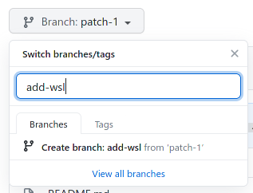

Generally, following what's already there works great (copy-pasta!).

Please make 1 Pull request per category, item, or anything else.

## Adding an item to the wishlist.
0. Leave this page open so you can use this as a reference!
1. Find a fitting category from the [index](README.md#index). If you don't find one, refer to [Adding a category](#adding-a-category).
1. Click the [edit](https://github.com/jtagcat/linux-wishlist/edit/master/README.md) at the top of the readme.
1. Use the copy-pasta boilerplate below. There are a few requirements:
   1. All items must be in alphabetical order.
   1. If there are no known alternatives, use `Alternatives: None known.`.
   1. Optionally, to be potentially contacted by a developer willing to make the app, after an empty line, you may add 'Added by @yourusername'. This is included in the boilerplate, delete if unwanted.
1. (These requirements are already included in the boilerplate.)
   1. Each app shall include a short description of what it does.
   1. Notable features should be listed, 'Why do you want this app on Linux?'. Note that the list must begin with an empty line.
   1. Each app should include the app's possible alternatives.
   1. Each app, except the very last one in the very last category should end with a horizontal line (`***`)

Here's a copy-pasta boilerplate:
```
#### [Name of Item](https://link-to-homepage-of-item)
Short, brief description of what it does and why you miss it.

<details>
  <summary>Notable features</summary>

 - Foo
 - Bar
 - Baz
</details>

##### Alternatives: None known.
 - [Alternative one](https://link-to-homepage-of-alternative-one)
 - [Alternative two](https://link-to-homepage-of-alternative-two)

Added by @yourusername
***
```


### Adding a category.
1. Think of a good name for the category. It shouldn't be too specific to your application - 1 category per app will be quite useless.
1. Add your category to the wishlist:
   1. Categories are alphabetically ordered.
   1. Categories must follow headline hierarchy (starts with `### `).
   1. Categories are in [title case](https://en.wikipedia.org/wiki/Capitalization#Title_case).
   1. Categories shall follow British grammar rules. You may use [LanguageTool](https://languagetool.org/) to check spelling.
   1. All category names must end with `[⤒](#index)`. This allows jumping to the index.
1. Add the category to the index:
   1. Items are alphabetically ordered.
   1. The categories are listed as an unordered list in the index (starts with ` - `).
   1. To allow jumping, the category name must be a relative link. (` - [Automation and Scripting](#automation-and-scripting-)`). Generally, GitHub generates the id (`#something-something-`) by following:
      1. `Everything Lowercase` -> `#everything-lowercase`
      1. `Spaces to Dashes` -> `#spaces-to-dashes`
      1. `Jump to Index to Dash ⤒` -> `#jump-to-index-to-dash-`
1. Make a pull request.
1. If you created a category, and will add an item to the wishlist right away, create a new branch from the new category's branch. (do this:)
